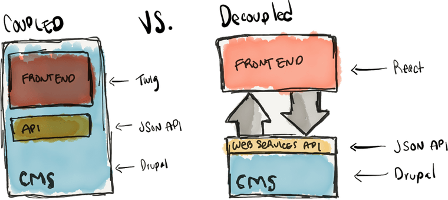

# 创建一个解耦的Drupal 9&React应用

## Overview




We can see that in the decoupled way Drupal is exposing internal resources through its web services API. It makes me question:

1. Can we still utilize the the Field, Form API?
2. Does it change any global variable defined by Drupal \(e.g., $user\)?
3. How to dynamically/conditionally render elements in React?
4. How does access control change?
5. What's the advantages besides the boosted efficiency in front-end implementation leveraging React?

### React

* JS library for UI
* Huge ecosystem like different modules and libraries
* Nothing special

### Drupal

* Open-source CMS
* Implementing editorial workflows
* Suite of tool for modeling \(Entity API\)
* Support JSON API, and
* GraphQL \(卧槽）

## Outline

* **Configure Drupal to serve data**
* **Create React App**
* **Define React Components**
* **Fetch Data and Display**

## Step 1: Configure Drupal to serve data <a id="81ae"></a>

### **1. Setup Drupal using Composer**

> Composer, it’s a PHP dependency manager which can be used to download Drupal, Drupal contributed projects \(modules, themes, etc.\), and all of their respective dependencies.

#### The tutorial used Drupal 8.x, but I will change it to Drupal 9.

```bash
composer create-project drupal/recommended-project travel_destinations "^9.0" --stability=dev --prefer-dist
```

‘travel\_destinations’ being the directory where Drupal project will be installed.

This command downloads latest Drupal \(version 9\) in the web directory and other dependencies in the vendor directory.

 Now we need to create a virtual host \(say [http://td-drupal.local\)](http://td-drupal.local%29/) pointing to web directory so that we can access it on the web browser.

### **2. Install Drupal**

Before installing Drupal we need to create a database which Drupal will be using and corresponding user with all privileges on that database. There are multiple ways to install Drupal

1. via interactive UI provided by default by Drupal \(which can be accessed via visiting [http://td-drupal.local](http://td-drupal.local/) in the browser\) 
2. or using drush [https://www.drupal.org/docs/8/install](https://www.drupal.org/docs/8/install) [https://drushcommands.com/drush-9x/site/site:install/](https://drushcommands.com/drush-9x/site/site:install/)
3. use [Drupal Console](https://drupalconsole.com/).

**Problem encountered:**



**Where is drush install \(is there sth. like a node\_modules\)?**



**Composer runs out of memory:**

Fatal error: Allowed memory size of 1610612736 bytes exhausted \(tried to allocate 4096 bytes\) in phar:

Solution: increase PHP mem size: 



1. sudo cp /etc/php.ini.default /etc/php.ini
2. sudo su
3. vi /etc/php.ini and change memory to -1 \(unlimited\)
4. apachectl restart
5. `php -r "echo ini_get('memory_limit').PHP_EOL;` should give you -1

Then we can finally run

```text
composer require --dev drush/drush
```

Note that the drush is installed in the local directory. If want a global drush manager, then try



#### Install MySQL



The configuration of database when we call `./vendor/bin/drush si`


Add the export in `~/.bash_profile` and restart bash \(note: NOT .bashrc\):


I set the username and password in the file ~/.mysql.config and add the alias in .bash\_profile

```bash
alias mysql="/usr/local/mysql/bin/mysql --defaults-extra-file=~/.mysql.config"
```

Test MySQL connection:


**Proceed with `drush si`**

Problem 2: 

SQLSTATE\[HY000\] \[2054\] The server requested authentication method unknown to the client \#1392


Need to grant permission




Flush the privileges to make sure the user has active privileges by adding the following the mysql terminal:  
`FLUSH PRIVILEGES;`

**REMOVE MYSQL INSTALLED FROM WEB**



clean up the directories:



**INSTALL MYSQL FROM HOMEBREW**

`brew install mysql`

Get the installed location: `$(brew --prefix mysql)` \($ is needed, not the bash prompt\)

Change ~/.bash\_profile

```text
$(brew --prefix mysql)
```

Unset the password \(default one in unknown\)

```text
sudo $(brew --prefix mysql)/bin/mysqladmin -u root password root
```

Install Drupal 9: `./vendor/bin/drush si`

```bash
 [notice] Starting Drupal installation. This takes a while.
 [notice] Performed install task: install_select_language
 [notice] Performed install task: install_select_profile
 [notice] Performed install task: install_load_profile
 [notice] Performed install task: install_verify_requirements
 [notice] Performed install task: install_settings_form
 [notice] Performed install task: install_verify_database_ready
 [notice] Performed install task: install_base_system
 [notice] Performed install task: install_bootstrap_full
 [notice] Performed install task: install_profile_modules
 [notice] Performed install task: install_profile_themes
 [notice] Performed install task: install_install_profile
 [notice] Performed install task: install_configure_form
 [notice] Cron run completed.
 [notice] Performed install task: install_finished
 [success] Installation complete.  User name: admin  User password: ZVQsSGhsP7
```

### **3. Download and Install Required Modules**

we need to add [JSON API module](https://www.drupal.org/project/jsonapi) and for this, we can download the module using composer and then enable it. Additionally, let’s download the [Admin Toolbar](http://drupal.org/project/admin_toolbar) module as well for faster navigation.

```text
composer require drupal/jsonapi
composer require drupal/admin_toolbar
```

This will download and place the JSON API module in travel\_destinations/web/modules/contrib directory. Enable the module either via logging into the website using the credentials used while installation in the previous step and navigating to [http://td-drupal.local/admin/module](http://td-drupal.local/admin/module) page or use drush packaged in your project.

```text
vendor/bin/drush en -y admin_toolbar admin_toolbar_tools jsonapi
```

**Question**: Where is the URL for the installed Drupal 9 site?

```text
drush runserver
```


Error is thrown

```text
Parse error: syntax error, unexpected '?', expecting variable (T_VARIABLE) in /Users/qidian/git/travel_destinations/vendor/laminas/laminas-diactoros/src/functions/marshal_uri_from_sapi.php on line 84
```






Need to update the PHP. I install the new version in Homebrew via`brew install php@7.4`


Location: `/usr/local/opt/php@7.4/bin/php`

**So we need to specify the above PHP version**

`/usr/local/opt/php@7.4/bin/php ./vendor/bin/drush serve`


I also created a file `drupal_start.sh` and copied the above script.

啦啦啦


Initial tables

`block_content`, `block_content__body`, `block_content_field_data`, `block_content_field_revision`, `block_content_revision`, `block_content_revision__body`, `cache_bootstrap`, `cache_config`, `cache_container`, `cache_data`, `cache_default`, `cache_discovery`, `cache_dynamic_page_cache`, `cache_entity`, `cache_menu`, `cache_page`, `cache_render`, `cachetags`, `comment`, `comment__comment_body`, `comment_entity_statistics`, `comment_field_data`, `config`, `file_managed`, `file_usage`, `flood`, `history`, `key_value`, `key_value_expire`, `menu_link_content`, `menu_link_content_data`, `menu_link_content_field_revision`, `menu_link_content_revision`, `menu_tree`, `node`, `node_access`, `node__body`, `node__comment`, `node_field_data`, `node__field_image`, `node_field_revision`, `node__field_tags`, `node_revision`, `node_revision__body`, `node_revision__comment`, `node_revision__field_image`, `node_revision__field_tags`, `path_alias`, `path_alias_revision`, `router`, `search_dataset`, `search_index`, `search_total`, `semaphore`, `sequences`, `sessions`, `shortcut`, `shortcut_field_data`, `shortcut_set_users`, `taxonomy_index`, `taxonomy_term_data`, `taxonomy_term_field_data`, `taxonomy_term_field_revision`, `taxonomy_term__parent`, `taxonomy_term_revision`, `taxonomy_term_revision__parent`, `user__roles`, `users`, `users_data`, `users_field_data`, `user__user_picture`, `watchdog`

### **4. Create Content Type & some sample content**

**Before that, create admin user**

\*\*\*\*

| drush user-create qidian --mail="diqi@ucsd.edu" --password="qidian"; drush user-add-role "administrator" adminuser |
| :--- |


  




**Add new content type and give the name as ‘Destination’.** Then add some sample destinations: 


### **5. Review JSON web service API**

_JSON API module requires no configurations, as soon enabled it just works._

We can visit our local website `${URL}/jsonapi`  
But it's better to visit the URL in Postman




destination contents are available as JSON data on 




```javascript
{
    "jsonapi": {
        "version": "1.0",
        "meta": {
            "links": {
                "self": {
                    "href": "http://jsonapi.org/format/1.0/"
                }
            }
        }
    },
    "data": [
        {
            "type": "node--destination",
            "id": "2fa2a231-de58-4bc2-90a7-3fe716d184f7",
            "links": {
                "self": {
                    "href": "http://127.0.0.1:8888/jsonapi/node/destination/2fa2a231-de58-4bc2-90a7-3fe716d184f7?resourceVersion=id%3A1"
                }
            },
            "attributes": {
                "drupal_internal__nid": 1,
                "drupal_internal__vid": 1,
                "langcode": "en",
                "revision_timestamp": "2020-07-07T19:10:57+00:00",
                "revision_log": null,
                "status": true,
                "title": "UCSD",
                "created": "2020-07-07T19:10:44+00:00",
                "changed": "2020-07-07T19:10:57+00:00",
                "promote": true,
                "sticky": false,
                "default_langcode": true,
                "revision_translation_affected": true,
                "path": {
                    "alias": null,
                    "pid": null,
                    "langcode": "en"
                },
                "body": {
                    "value": "<p>9450 Gilman Drive</p>\r\n",
                    "format": "basic_html",
                    "processed": "<p>9450 Gilman Drive</p>",
                    "summary": ""
                }
            },
            "relationships": {
                "node_type": {
                    "data": {
                        "type": "node_type--node_type",
                        "id": "112a4178-d925-4427-bb8e-e68247bac7be"
                    },
                    "links": {
                        "related": {
                            "href": "http://127.0.0.1:8888/jsonapi/node/destination/2fa2a231-de58-4bc2-90a7-3fe716d184f7/node_type?resourceVersion=id%3A1"
                        },
                        "self": {
                            "href": "http://127.0.0.1:8888/jsonapi/node/destination/2fa2a231-de58-4bc2-90a7-3fe716d184f7/relationships/node_type?resourceVersion=id%3A1"
                        }
                    }
                },
                "revision_uid": {
                    "data": {
                        "type": "user--user",
                        "id": "018134bb-c07c-453e-98d9-4a6311dec9cc"
                    },
                    "links": {
                        "related": {
                            "href": "http://127.0.0.1:8888/jsonapi/node/destination/2fa2a231-de58-4bc2-90a7-3fe716d184f7/revision_uid?resourceVersion=id%3A1"
                        },
                        "self": {
                            "href": "http://127.0.0.1:8888/jsonapi/node/destination/2fa2a231-de58-4bc2-90a7-3fe716d184f7/relationships/revision_uid?resourceVersion=id%3A1"
                        }
                    }
                },
                "uid": {
                    "data": {
                        "type": "user--user",
                        "id": "018134bb-c07c-453e-98d9-4a6311dec9cc"
                    },
                    "links": {
                        "related": {
                            "href": "http://127.0.0.1:8888/jsonapi/node/destination/2fa2a231-de58-4bc2-90a7-3fe716d184f7/uid?resourceVersion=id%3A1"
                        },
                        "self": {
                            "href": "http://127.0.0.1:8888/jsonapi/node/destination/2fa2a231-de58-4bc2-90a7-3fe716d184f7/relationships/uid?resourceVersion=id%3A1"
                        }
                    }
                }
            }
        },
        {
            "type": "node--destination",
            "id": "f2aaaadc-84c8-47e4-996b-6549adccff93",
            "links": {
                "self": {
                    "href": "http://127.0.0.1:8888/jsonapi/node/destination/f2aaaadc-84c8-47e4-996b-6549adccff93?resourceVersion=id%3A2"
                }
            },
            "attributes": {
                "drupal_internal__nid": 2,
                "drupal_internal__vid": 2,
                "langcode": "en",
                "revision_timestamp": "2020-07-07T19:11:11+00:00",
                "revision_log": null,
                "status": true,
                "title": "Palms",
                "created": "2020-07-07T19:11:04+00:00",
                "changed": "2020-07-07T19:11:11+00:00",
                "promote": true,
                "sticky": false,
                "default_langcode": true,
                "revision_translation_affected": true,
                "path": {
                    "alias": null,
                    "pid": null,
                    "langcode": "en"
                },
                "body": {
                    "value": "<p>3535 Lebon Drive</p>\r\n",
                    "format": "basic_html",
                    "processed": "<p>3535 Lebon Drive</p>",
                    "summary": ""
                }
            },
            "relationships": {
                "node_type": {
                    "data": {
                        "type": "node_type--node_type",
                        "id": "112a4178-d925-4427-bb8e-e68247bac7be"
                    },
                    "links": {
                        "related": {
                            "href": "http://127.0.0.1:8888/jsonapi/node/destination/f2aaaadc-84c8-47e4-996b-6549adccff93/node_type?resourceVersion=id%3A2"
                        },
                        "self": {
                            "href": "http://127.0.0.1:8888/jsonapi/node/destination/f2aaaadc-84c8-47e4-996b-6549adccff93/relationships/node_type?resourceVersion=id%3A2"
                        }
                    }
                },
                "revision_uid": {
                    "data": {
                        "type": "user--user",
                        "id": "018134bb-c07c-453e-98d9-4a6311dec9cc"
                    },
                    "links": {
                        "related": {
                            "href": "http://127.0.0.1:8888/jsonapi/node/destination/f2aaaadc-84c8-47e4-996b-6549adccff93/revision_uid?resourceVersion=id%3A2"
                        },
                        "self": {
                            "href": "http://127.0.0.1:8888/jsonapi/node/destination/f2aaaadc-84c8-47e4-996b-6549adccff93/relationships/revision_uid?resourceVersion=id%3A2"
                        }
                    }
                },
                "uid": {
                    "data": {
                        "type": "user--user",
                        "id": "018134bb-c07c-453e-98d9-4a6311dec9cc"
                    },
                    "links": {
                        "related": {
                            "href": "http://127.0.0.1:8888/jsonapi/node/destination/f2aaaadc-84c8-47e4-996b-6549adccff93/uid?resourceVersion=id%3A2"
                        },
                        "self": {
                            "href": "http://127.0.0.1:8888/jsonapi/node/destination/f2aaaadc-84c8-47e4-996b-6549adccff93/relationships/uid?resourceVersion=id%3A2"
                        }
                    }
                }
            }
        },
        {
            "type": "node--destination",
            "id": "7443a680-ef6d-4bff-b9e9-6e0f06626223",
            "links": {
                "self": {
                    "href": "http://127.0.0.1:8888/jsonapi/node/destination/7443a680-ef6d-4bff-b9e9-6e0f06626223?resourceVersion=id%3A3"
                }
            },
            "attributes": {
                "drupal_internal__nid": 3,
                "drupal_internal__vid": 3,
                "langcode": "en",
                "revision_timestamp": "2020-07-07T19:11:46+00:00",
                "revision_log": null,
                "status": true,
                "title": "UTC",
                "created": "2020-07-07T19:11:19+00:00",
                "changed": "2020-07-07T19:11:46+00:00",
                "promote": true,
                "sticky": false,
                "default_langcode": true,
                "revision_translation_affected": true,
                "path": {
                    "alias": null,
                    "pid": null,
                    "langcode": "en"
                },
                "body": {
                    "value": "<p>4545 La Jolla Village Dr Suite e-25</p>\r\n",
                    "format": "basic_html",
                    "processed": "<p>4545 La Jolla Village Dr Suite e-25</p>",
                    "summary": ""
                }
            },
            "relationships": {
                "node_type": {
                    "data": {
                        "type": "node_type--node_type",
                        "id": "112a4178-d925-4427-bb8e-e68247bac7be"
                    },
                    "links": {
                        "related": {
                            "href": "http://127.0.0.1:8888/jsonapi/node/destination/7443a680-ef6d-4bff-b9e9-6e0f06626223/node_type?resourceVersion=id%3A3"
                        },
                        "self": {
                            "href": "http://127.0.0.1:8888/jsonapi/node/destination/7443a680-ef6d-4bff-b9e9-6e0f06626223/relationships/node_type?resourceVersion=id%3A3"
                        }
                    }
                },
                "revision_uid": {
                    "data": {
                        "type": "user--user",
                        "id": "018134bb-c07c-453e-98d9-4a6311dec9cc"
                    },
                    "links": {
                        "related": {
                            "href": "http://127.0.0.1:8888/jsonapi/node/destination/7443a680-ef6d-4bff-b9e9-6e0f06626223/revision_uid?resourceVersion=id%3A3"
                        },
                        "self": {
                            "href": "http://127.0.0.1:8888/jsonapi/node/destination/7443a680-ef6d-4bff-b9e9-6e0f06626223/relationships/revision_uid?resourceVersion=id%3A3"
                        }
                    }
                },
                "uid": {
                    "data": {
                        "type": "user--user",
                        "id": "018134bb-c07c-453e-98d9-4a6311dec9cc"
                    },
                    "links": {
                        "related": {
                            "href": "http://127.0.0.1:8888/jsonapi/node/destination/7443a680-ef6d-4bff-b9e9-6e0f06626223/uid?resourceVersion=id%3A3"
                        },
                        "self": {
                            "href": "http://127.0.0.1:8888/jsonapi/node/destination/7443a680-ef6d-4bff-b9e9-6e0f06626223/relationships/uid?resourceVersion=id%3A3"
                        }
                    }
                }
            }
        }
    ],
    "links": {
        "self": {
            "href": "http://127.0.0.1:8888/jsonapi/node/destination"
        }
    }
}
```


**Title and body values are shipped under attributes key.**

**More info on JSONAPI:** [**https://www.drupal.org/docs/8/modules/jsonapi**](https://www.drupal.org/docs/8/modules/jsonapi)\*\*\*\*

## Step 2: Create React App <a id="3b62"></a>

**轻车熟路**

```text
npx create-react-app react_app
cd react_app
npm start
```

Folder `public` contains public assets and index.html file and src directory contains `index.js` which renders React Application into your website.

### **React Concepts**

1. **Components**
   * 帮助我们实现Atomic前端开发（由小组成大）
2. **Props**
   * 传进来的参数
3. **State**
   * 状态
4. **JSX \(Javascript XML）**
   * Shortcut for creating elements \(div\) and store them in variables

## Step 3: Define React Components <a id="c7b7"></a>

> We are building Travel Destinations Listing Application, we basically are showing Destination Item which can be thought of the atomic level element or component as per React vocabulary. Multiple Destination Items combined together generates Destination List and this Destination List is the main part of our App.

 An overview of the React Components in our application:

— App  
— — DestinationList  
— — — DestinationItem


```jsx
import React from 'react';

export default class DestinationItem extends React.Component {

  render() {
    return (
      <div>
        <h2>Travel Destination Title</h2>
        <div>Travel Destination Description goes here</div>
      </div>
    );
  }

}
```




```jsx
import React from 'react';
import DestinationItem from "./DestinationItem";

export default class DestinationList extends React.Component {

  render() {
    return (
      <div>
        <h1>Here are your best Travel Destinations</h1>
        <DestinationItem />
      </div>
    );
  }
}

```




```jsx
import React, { Component } from 'react';
import logo from './logo.svg';
import './App.css';
import DestinationList from "./Components/Destination/DestinationList";

class App extends Component {
  render() {
    return (
      <div className="App">
        <DestinationList/>
      </div>
    );
  }
}

export default App;
```



## Step 4: Fetch Data & Display <a id="6526"></a>

### **1. Fetch Data**

> We cannot modify the state directly. Instead, we update the state using the setState method. And to trigger all this we will use one lifecycle method ‘componentWillMount’ and this method is only called one time, which is before the initial render. Add a constructor in App.js as follows:


```jsx
import React, { Component } from 'react';
import logo from './logo.svg';
import './App.css';
import DestinationList from "./Components/Destination/DestinationList";

const LIST_URL = 'http://127.0.0.1:8888/jsonapi/node/destination';


class App extends Component {
  constructor() {
    super();
    this.state = { data: null };
    this.loadDestinations = this.loadDestinations.bind(this);
    this.updateData = this.updateData.bind(this);
  }

  componentWillMount() {
    this.loadDestinations();
  }

  loadDestinations() {
    // Fetch Destinations.
    fetch(LIST_URL, { mode: 'cors' })
      .then(function (response) {
        return response.json();
      })
      .then((data) => {
        console.log(data);
        this.updateData(data);
      })
      .catch(err => console.log('Fetching Destinations Failed', err));
  }

  updateData(responseData) {
    this.setState({ data: responseData.data });
  }

  render() {
    return (
      <div className="App">
        <DestinationList
          data={this.state.data}
        />
      </div>
    );
  }
}

export default App;

```


**Problem**: CORS


**Solution**: have CORS configured on /admin/config/services/cors \(deprecated, see below\)



So we change `web/sites/default/default.services.yml` to be


> Find: .../sites/default/default.services.yml
>
> Make a copy and rename the copy to:
>
> .../sites/default/services.yml
>
> Find this part of the code: cors.config: enabled: false
>
> and replace with the following - cors.config: enabled: true
>
> Clear the cache.

WORKED! 


```yaml
  cors.config:
    enabled: true
      # Specify allowed headers, like 'x-allowed-header'.
    allowedHeaders: ['x-csrf-token','authorization','content-type','accept','origin','x-requested-with', 'access-control-allow-origin','x-allowed-header','*']
      # Specify allowed request methods, specify ['*'] to allow all possible ones.
    allowedMethods: ['*']
      # Configure requests allowed from specific origins.
    allowedOrigins: ['http://localhost/','http://localhost:3000','http://localhost:3001','http://localhost:3002','*']
      # Sets the Access-Control-Expose-Headers header.
    exposedHeaders: false
      # Sets the Access-Control-Max-Age header.
    maxAge: false
      # Sets the Access-Control-Allow-Credentials header.
    supportsCredentials: true
```


**NOTE: Default is only for restoring default settings!**


### **2. Display Data**

Collect that data in DestinationList class in DestinationList.js file and after quick check create an array of DestinationItem passing the item.

Using Array.map function to send the complete item using {…item} to DestinationItem class as props and key as item.id


```jsx
import React from 'react';
import DestinationItem from "./DestinationItem";

export default class DestinationList extends React.Component {

  render() {
    let { data } = this.props;
    return (
      <div>
        <h1>Here are your best Travel Destinations</h1>
        {data !== null &&
          data !== undefined &&
          data.length > 0 ?
          data.map(item => <DestinationItem {...item} key={item.id} />)
          :
          <div>No destinations found.</div>
        }
      </div>
    );
  }
}
```




```jsx
import React from 'react';

export default class DestinationItem extends React.Component {

  render() {
    return (
      <div>
        <h2>{this.props.attributes.title}</h2>
        <div dangerouslySetInnerHTML={{__html: this.props.attributes.body.value}} />
      </div>
    );
  }

}
```



## Conclusion

* Simple tutorial
* Primarily deployment
* Show the power of DevDesktop that bundle all the environment for you

